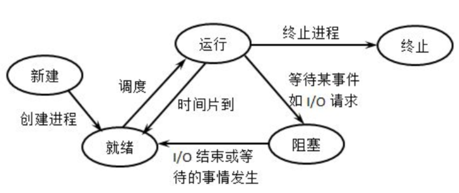

## 进程调度
#### 整体思路
在进程调度模块，我仿照linux的进程调度，实现了一个进程调度算法的框架，基于该框架，进行调度算法的开发变得简单。

调度框架基于的数据结构为就绪队列和等待队列，就绪队列为全局的队列，在操作系统中等待队列可同时存在多条，根据进程阻塞的原因划分。就绪队列的数据结构为优先队列。调度框架将调度算法的主要分为初始化，入队,出队，从就绪队列选择下一个进程，时间片函数等五个函数，使用函数指针构建框架，实现具体调度策略只需要实现其规定的函数。

基于该调度框架我尝试了尽可能多的调度算法，其中包括简单的FCFS，RR调度，也包括CFS,多级反馈优先队列，Stride Scheduling此类基于优先级的调度算法。

#### 理论分析
##### 进程状态转换 


这里通过该图分析进程的状态转换关系，进程从创建到结束，可能经历以下的步骤：
1. 进程首先在cpu初始化或者fork创建，当为该进程分配了一个进程控制块之后，该进程进入uninit状态。
2. 当进程完全完成初始化之后，该进程转为runnable态，进入就绪队列。
3. 当到达调度点时，由调度器根据就绪队列的内容来判断一个进程是否应该被运行，即把处于runnable态的进程转换成running状态，从而占用CPU执行。
4. running态的进程通过wait等系统调用被阻塞，进入sleeping态，进入对应的阻塞队列。
5. sleeping态的进程被wakeup变成runnable态的进程，进程从阻塞队列转移到就绪队列。
6. running态的进程主动exit变成zombie态，然后由其父进程完成对其资源的最后释放，子进程的进程控制块成为unused。

进程调度的目标即何时从就绪队列中选取合适的进程进入执行状态，已达到全局最优的效果。

##### 进程调度的时机

操作系统进行进程调度的时刻大致有以下几种：
1. 进程结束，主动放弃cpu使用权。
2. 进程wait，即无法获取某种资源，进入阻塞状态，进程需要进入阻塞队列，cpu让出。
3. 进程从中断、异常及系统调用返回到用户态时。
4. 进程的时间片用完。


#### 调度框架


##### 数据结构

为了定义调度框架，首先需要定义就绪队列，值得注意的是就绪队列的结构需要根据具体的算法做扩充，如后边三个变量为支持特定算法的数据结构，在运行其他算法时，这些变量没有作用：

```c
struct run_queue {
    //队列的头尾
    list_entry_t run_list;
    //进程总数
    unsigned int proc_num;
    //最大时间片
    int max_time_slice;
    // 优先队列形式的进程容器,用于Stride Scheduling调度
    skew_heap_entry_t *ss_run_pool;
    // 优先队列形式的进程容器,用于CFS调度
    skew_heap_entry_t *fair_run_pool;
    //队列的头尾，用于多级反馈，所以有多个
    list_entry_t MLFQ_run_list[MAX_QUEUE];
};

```
运行队列通过链表的形式进行组织。运行队列每一个元素为一个链表节点，即list_entry_t,每个节点对应一个PCB。

为了支持调度算法，PCB需要以下变量：

```c
struct PCB{
    //就绪队列
    struct run_queue *rq;        
    //是否需要调度
    bool need_resched;            
    //调度链表  
    list_entry_t run_link;     
    //时间片                 
    int time_slice;                            
    //Stride Scheduling 算法的运行池
    skew_heap_entry_t ss_run_pool;            
    //Stride Scheduling 算法的stride
    uint32_t stride;             
    //优先级          
    uint32_t ss_priority;                    
    //以下三个变量用于CFS调度算法
    //运行时间
    int vruntime;                          
    //优先级
    int fair_priority;                          
    //CFS运行池
    skew_heap_entry_t fair_run_pool;     
}
```

调度类的框架数据结构如下,均以函数指针定义，方便后续实现确定的算法。

```c
struct sched_class {
    //调度算法的名字
    const char *name;
    // 初始化队列
    void (*init)(struct run_queue *rq);
    // 加入运行队列
    void (*enqueue)(struct run_queue *rq, struct PCB *proc);
    // 出队列
    void (*dequeue)(struct run_queue *rq, struct PCB *proc);
    // 选取一个就绪进程，运行
    struct PCB *(*pick_next)(struct run_queue *rq);
    // 时间片处理函数
    void (*proc_tick)(struct run_queue *rq, struct PCB *proc);
};
```
##### 调度框架向外接口 
调度类向外提供的接口包括，各个接口都使用调度类中的函数指针实现，在运行时，被替换成具体的调度算法：
```c
//调度类初始化，开机调用
void sched_init(void);
//进程唤醒，wakeup调用，唤醒之后加入就绪队列
void wakeup_proc(struct PCB *proc);
//进程调度，选取一个进程运行，若无进程，则运行idle进程
void schedule(void);
//中断时调用
void sched_class_proc_tick(struct PCB *proc);
```

具体实现：
```c
void wakeup_proc(struct PCB *proc) {
    assert(proc->state != PROC_ZOMBIE);
    bool intr_flag;
    //原子操作
    local_intr_save(intr_flag);
    {
        if (proc->state != PROC_RUNNABLE) {
            proc->state = PROC_RUNNABLE;
            proc->wait_state = 0;
            if (proc != current) {
                sched_class_enqueue(proc);
            }
        }
    }
    local_intr_restore(intr_flag);
}

void
schedule(void) {
    bool intr_flag;
    struct PCB *next;
    //原子操作
    local_intr_save(intr_flag);
    {
        current->need_resched = 0;
        //如果是就绪态，则入队
        if (current->state == PROC_RUNNABLE) {
            sched_class_enqueue(current);
        }
        //选取下一个就绪进程
        if ((next = sched_class_pick_next()) != NULL) {
            sched_class_dequeue(next);
        }
        //如果没有，运行idle
        if (next == NULL) {
            next = idleproc;
        }
        next->runs ++;
        if (next != current) {
            proc_run(next);
        }
    }
    local_intr_restore(intr_flag);
}

```

#### 具体算法
##### FCFS
先来先服务的算法实现起来非常简单，只需每次取列表中头一个进程即可：
```c
//初始化队列,队列使用链表，无需使用优先队列
static void
FCFS_init(struct run_queue *rq) {
    list_init(&(rq->run_list));
    rq->proc_num = 0;
}
//加入队列
static void
FCFS_enqueue(struct run_queue *rq, struct PCB *proc) {
    assert(list_empty(&(proc->run_link)));
    list_add_before(&(rq->run_list), &(proc->run_link));
    proc->rq = rq;
    rq->proc_num ++;
}
//从队列中删除
static void
FCFS_dequeue(struct run_queue *rq, struct PCB *proc) {
    assert(!list_empty(&(proc->run_link)) && proc->rq == rq);
    list_del_init(&(proc->run_link));
    rq->proc_num --;
}
//从链表头选取下一个进程
static struct PCB *
FCFS_pick_next(struct run_queue *rq) {
    list_entry_t *le = list_next(&(rq->run_list));
    if (le != &(rq->run_list)) {
        return le2proc(le, run_link);
    }
    return NULL;
}
```
##### RR调度
RR调度算法的调度思想 是让所有runnable态的进程分时轮流使用CPU时间。RR调度器维护当前runnable进程的有序运行队列。当前进程的时间片用完之后，调度器将当前进程放置到运行队列的尾部，再从其头部取出进程进行调度。

RR调度算法的就绪队列在组织结构上也是一个双向链表，只是增加了一个成员变量，表明在此就绪进程队列中的最大执行时间片。而且在进程控制块PCB中增加了一个成员变量time_slice，用来记录进程当前的可运行时间片段。这是由于RR调度算法需要考虑执行进程的运行时间不能太长。在每个timer到时的时候，操作系统会递减当前执行进程的time_slice，当time_slice为0时，就意味着这个进程运行了一段时间（这个时间片段称为进程的时间片），需要把CPU让给其他进程执行，于是操作系统就需要让此进程重新回到rq的队列尾，且重置此进程的时间片为就绪队列的成员变量最大时间片max_time_slice值，然后再从rq的队列头取出一个新的进程执行。

具体实现：
```c
//进程入队尾，如果时间片为0，需要将时间片设为最大值
static void
RR_enqueue(struct run_queue *rq, struct PCB *proc) {
    list_add_before(&(rq->run_list), &(proc->run_link));
    if (proc->time_slice == 0 || proc->time_slice > rq->max_time_slice) {
        proc->time_slice = rq->max_time_slice;
    }
    proc->rq = rq;
    rq->proc_num ++;
}
//进程直接出队
static void
RR_dequeue(struct run_queue *rq, struct PCB *proc) {
    list_del_init(&(proc->run_link));
    rq->proc_num --;
}
//链表头选取下一个进程
static struct PCB *
RR_pick_next(struct run_queue *rq) {
    list_entry_t *le = list_next(&(rq->run_list));
    if (le != &(rq->run_list)) {
        return le2proc(le, run_link);
    }
    return NULL;
}
//时间片每个周期减一，时间片用完时，需要进行调度
static void
RR_proc_tick(struct run_queue *rq, struct PCB *proc) {
    if (proc->time_slice > 0) {
        proc->time_slice --;
    }
    if (proc->time_slice == 0) {
        proc->need_resched = 1;
    }
}
```

##### CFS
cfs定义了一种新的模型，它给每一个进程安排一个虚拟时钟，vruntime。如果一个进程得以执行，随着时间的增长（也就是一个个tick的到来），其vruntime将不断增大。没有得到执行的进程vruntime不变。而调度器总是选择vruntime跑得最慢的那个进程来执行。这就是所谓的“完全公平”。为了区别不同优先级的进程，优先级高的进程vruntime增长得慢，以至于它可能得到更多的运行机会。

所以为了队列按照vruntime排序，不能再继续使用链表，需要使用优先队列的数据结构：
```c
//向优先队列中插入，fair_run_pool为cfs的优先队列，proc_fair_comp_f为比较函数，写法类似sort函数的cmp，比较二者的vruntime
static void fair_enqueue(struct run_queue *rq, struct PCB *proc) {
    rq->fair_run_pool = skew_heap_insert(rq->fair_run_pool, &(proc->fair_run_pool), proc_fair_comp_f);
    if (proc->time_slice == 0 || proc->time_slice > rq->max_time_slice)
        proc->time_slice = rq->max_time_slice;
    proc->rq = rq;
    rq->proc_num ++;
}
//直接删除即可
static void fair_dequeue(struct run_queue *rq, struct PCB *proc) {
    rq->fair_run_pool = skew_heap_remove(rq->fair_run_pool, &(proc->fair_run_pool), proc_fair_comp_f);
    rq->proc_num --;
}
//选取优先队列第一个，即vruntime最少的那个
static struct PCB * fair_pick_next(struct run_queue *rq) {
    if (rq->fair_run_pool == NULL)
        return NULL;
    skew_heap_entry_t *le = rq->fair_run_pool;
    struct PCB * p = le2proc(le, fair_run_pool);
    return p;
}
//每个进程的在运行的进程vruntime需要加上相应的优先级，这里优先级的数值越低，代表优先级越高，vruntime增长越慢，得到的运行机会越多
static void
fair_proc_tick(struct run_queue *rq, struct PCB *proc) {
    if (proc->time_slice > 0) {
        proc->time_slice --;
        proc->vruntime += proc->fair_priority;
    }
    if (proc->time_slice == 0) {
        proc->need_resched = 1;
    }
}
```
##### Stride Scheduling

Stride Scheduling的思路与CFS类似，区别在于，他没有记录运行时间，而是记录分配cpu的次数，他的stride不在每次tick调用时增加，而是在每次为该进程分配资源时增加。

具体来看，为每个runnable的进程设置一个当前状态stride，表示该进程当前的调度权。另外定义其对应的pass值，表示对应进程在调度后，stride 需要进行的累加值。pass与进程的优先级有关，每次需要调度时，从当前 runnable 态的进程中选择 stride最小的进程调度。

这里只展示SS算法与CFS不同的地方，即选取运行进程的函数：
```c
static struct PCB *
stride_pick_next(struct run_queue *rq) {
     if (rq->ss_run_pool == NULL) return NULL;
     struct PCB *p = le2proc(rq->ss_run_pool, ss_run_pool);
     //每次stride加的值与ss_priority有关，在这里ss_priority越大，优先级越大
     if (p->ss_priority == 0)
          p->stride += BIG_STRIDE;
     else p->stride += BIG_STRIDE / p->ss_priority;
     return p;
}
```

##### 多级反馈优先队列

有时我们需要优先级可以变化的动态调度算法，多级反馈优先队列将队列按照优先级分成多个队列，每次入队时，按照优先级入相应的队列。但是每次取运行进程时不能粗暴的取最高优先级队列的，需要按照概率为不同优先级分配概率。目的是为了解决饥饿的问题。在[0,2^MAX_QUEUE-1]之间取一个随机数，最高优先级被选中的概率为1/2,次优先级队列为1/4，以此类推，当该优先级队列不存在进程时，依次往下选取。

```c
//初始化多个队列
static void
MLFQ_init(struct run_queue *rq) {
    int i=0;
    for(;i<MAX_QUEUE;i++)
        list_init(&(rq->MLFQ_run_list[i]));
    rq->proc_num = 0;
}
//如果time_slice为0，即他完成了一个时间片，则把他的优先级降低
static void
MLFQ_enqueue(struct run_queue *rq, struct PCB *proc) {
    if (proc -> time_slice == 0 && proc -> ss_priority != MAX_QUEUE-1) {
        ++(proc -> ss_priority);
    }
    //加入到对应优先级的队列中
    list_add_before(&(rq->MLFQ_run_list[proc ->ss_priority]), &(proc->run_link));
    //分配的时间片与优先级有关，优先级越高，时间片越大
    proc->time_slice = (rq->max_time_slice << proc -> ss_priority);
    proc->rq = rq;
    rq->proc_num ++;
}

//为了解决饥饿的问题，不能直接选取最高优先级队列，而是通过概率的形式，在[0,2^MAX_QUEUE-1]之间取一个随机数，最高优先级被选中的概率为1/2,次优先级队列为1/4，以此类推，当该优先级队列不存在进程时，依次往下选取。
static struct PCB *
MLFQ_pick_next(struct run_queue *rq) {
    int r=(1<<MAX_QUEUE)-1;
    int p = rand() % r;
    int priority;
    int i=0,q=0;
    while(i<MAX_QUEUE){
         q+=1<<(MAX_QUEUE-i-1);
         if(p<q){
              priority=i;
              break;
         }
         i++;
    }
    list_entry_t *le = list_next(&(rq->MLFQ_run_list[priority]));
    if (le != &(rq->MLFQ_run_list[priority])) {
        return le2proc(le, run_link);
    } else {
        for (int i = 0; i < MAX_QUEUE; ++i) {
            if(priority==i) continue;
            le = list_next(&(rq->MLFQ_run_list[i]));
            if (le != &(rq -> MLFQ_run_list[i])) return le2proc(le, run_link);
        }
    }
    return NULL;
}

```

至此，我已将实现的所有算法介绍完毕，他们的配置方法如下,通过将函数指针赋值的方式确定具体的调度算法：
```c
#if MULTI_QUEUE
struct sched_class default_sched_class = {
     .name = "MLFQ_scheduler",
     .init = MLFQ_init,
     .enqueue = MLFQ_enqueue,
     .dequeue = MLFQ_dequeue,
     .pick_next = MLFQ_pick_next,
     .proc_tick = MLFQ_proc_tick,
};

#endif
```

### TODO
等待队列的实现，展示用例编写。